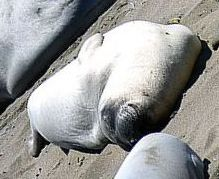
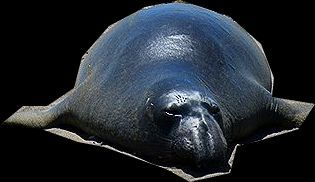
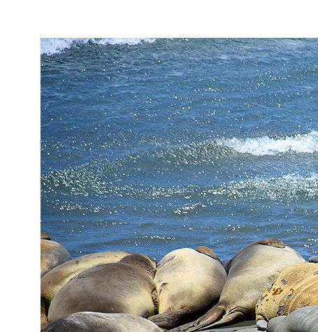

# express-sharp-server

[](https://travis-ci.org/3epnm/express-sharp-server) [](https://coveralls.io/github/3epnm/express-sharp-server?branch=master) [](https://snyk.io/test/github/3epnm/express-sharp-server) 

express-sharp-server is a middleware that implements a restful image server based on node-sharp.

```sh
npm install express-sharp-server
```

express-sharp-server is an evolving express middleware to implement an easy-to-use image server, with a focus on extraction of image parts. The goal is to provide all prominent functions of the node-sharp library in a express middleware.

### Example Server

```javascript
const express = require('express');
const image = require('express-sharp-server');

const server = express();

// express-sharp-server expects at least a data folder 
// where the image data can be stored.

server.use(image({
    data_dir: '/data/'
}));

server.listen(8080);
```

### Basic Usage

First of all, when the server is started, pictures can be uploaded.

```sh
curl -F "Document=@elefants.jpg" http://localhost:8080
```

In addition, it is possible to reference an image from another server by sending a image url to the server:

```json
{
    "_links": {
        "origin": {
            "href": "https://upload.wikimedia.org/wikipedia/commons/d/d7/Elefantes_Gustavo_Gerdel.jpg"
        }
    }
}
```

```sh
curl --header "Content-Type: application/json" \
  --request POST \
  --data '{ "_links": { "origin": { "href": "https://upload.wikimedia.org/wikipedia/commons/d/d7/Elefantes_Gustavo_Gerdel.jpg" } } }' \
  http://localhost:8080/
```

Then the server responds with the following payload in json.

```json
{
    "metadata": {
        "width": 1200,
        "height": 800,
        "channels": 3,
        "density": 300,
        "mimetype": "image/jpeg",
        "format": "jpeg"
    },
    "created": {
        "datetime": "2019-01-04T23:45:30.873Z"
    },
    "_links": {
        "self": {
            "href": "/0c97f820639ecbbbba0255ceb7a5f962"
        }
    }
}
```

The image is now stored on the server and can now be retrieved via the url ``` _links.self.href ``` specified.

```sh
curl http://localhost:8080/0c97f820639ecbbbba0255ceb7a5f962
```

The underlying information on the server can be queried if in addition an "Accept: application / json" header is sent.

```sh
curl --header "Accept: application/json" \
    http://localhost:8080/0c97f820639ecbbbba0255ceb7a5f962
```

The latter can be extended, vie a HTTP PUT request, by user data. Useful to save image license information.

```json
{
    "userdata": {
        "license": {
            "label": "CC BY-SA 4.0",
            "href": "https://creativecommons.org/licenses/by-sa/4.0",
            "attribution": "Ggerdel at Wikimedia Commons"
        }
    }
}
```

```sh
curl --header "Content-Type: application/json" \
  --request PUT \
  --data '{ "userdata": { "license": { "label": "CC BY-SA 4.0", "href": "https://creativecommons.org/licenses/by-sa/4.0", "attribution": "Ggerdel at Wikimedia Commons" } } } ' \
  http://localhost:8080/
```

### Features

The following examples are done in the following image found at Wikimedia Commons


[CC BY-SA 4.0](https://creativecommons.org/licenses/by-sa/4.0), Ggerdel at Wikimedia Commons

#### Width and Height

Request the Image with a specific width. The aspect ratio is retained.
```sh
curl http://localhost:8080/0c97f820639ecbbbba0255ceb7a5f962?width=400
```


Request the Image with a specific height. The aspect ratio is retained.
```sh
curl http://localhost:8080/0c97f820639ecbbbba0255ceb7a5f962?height=200
```


Request the Image with a specific width and height.
```sh
curl http://localhost:8080/0c97f820639ecbbbba0255ceb7a5f962?width=400&height=200
```


#### Extract part of image with polygon parameter

Simple rectangular extraction, without any rotation of the segment.
```sh
curl http://localhost:8080/0c97f820639ecbbbba0255ceb7a5f962 \
  ?polygon=[{x:421,y:264},{x:755,y:264},{x:755,y:453},{x:421,y:453}]
```


Simple rectangular extraction, with rotation of the segment.
```sh
curl http://localhost:8080/0c97f820639ecbbbba0255ceb7a5f962 \
  ?polygon=[{x:348,y:447},{x:505,y:599},{x:380,y:727},{x:224,y:576}]&rotation=315.94
```



Extraction of a more complex shape
```sh
curl http://localhost:8080/0c97f820639ecbbbba0255ceb7a5f962 \
  ?polygon=[{x:467,y:631},{x:490,y:612},{x:514,y:612},{x:541,y:594},{x:549,y:563},{x:576,y:532},{x:612,y:513},{x:647,y:506},{x:696,y:522},{x:728,y:550},{x:741,y:584},{x:739,y:603},{x:782,y:610},{x:766,y:635},{x:725,y:647},{x:704,y:652},{x:697,y:679},{x:657,y:688},{x:633,y:675},{x:571,y:653},{x:545,y:648},{x:508,y:635}]
```



#### Extension of the resulting image, if polygon parameter is outside of image

```sh
curl http://localhost:8080/0c97f820639ecbbbba0255ceb7a5f962 \
  ?polygon=[{x:-58,y:-54},{x:397,y:-54},{x:397,y:420},{x:-58,y:420}]
```



### Options

The following options can be set:

| Parameter 	| Comment    	|
|-----------	|-----------    |
| base_route  	| ...	|
| base_url  	| ...  	|
| upload_dir 	| The directory where the image uploads should be saved |
| cache_dir 	| The directory where the image cache should be saved |
| logger 	    | optional, a instance to winston logger 	|

### Tests

To run the test suite, first install the dependencies, then run `npm test`:

```bash
$ npm install
$ npm test
```

### Licensing

Copyright 2019 Marcel Bretschneider.

Licensed under the Apache License, Version 2.0 (the "License"); you may not use this file except in compliance with the License.
You may obtain a copy of the License at [https://www.apache.org/licenses/LICENSE-2.0](https://www.apache.org/licenses/LICENSE-2.0)

Unless required by applicable law or agreed to in writing, software distributed under the License is distributed on an "AS IS" BASIS, WITHOUT WARRANTIES OR CONDITIONS OF ANY KIND, either express or implied. See the License for the specific language governing permissions and limitations under the License.
