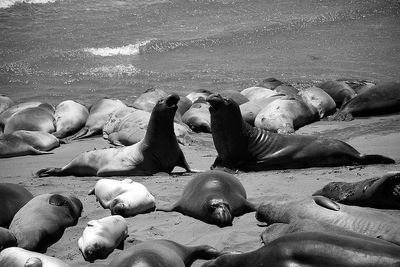

# express-sharp-server 

### examples

The following examples are done in the following image found at Wikimedia Commons


[CC BY-SA 4.0](https://creativecommons.org/licenses/by-sa/4.0), Ggerdel at Wikimedia Commons

#### Width, Height and Grayscale

Request the Image with a specific width. The aspect ratio is retained.
```sh
curl http://localhost:8080/0c97f820639ecbbbba0255ceb7a5f962?width=400
```


Request the Image with a specific height. The aspect ratio is retained.
```sh
curl http://localhost:8080/0c97f820639ecbbbba0255ceb7a5f962?height=200
```


Request the Image with a specific width and height.
```sh
curl http://localhost:8080/0c97f820639ecbbbba0255ceb7a5f962?width=400&height=200
```


Request the Image with a specific width and remove color.
```sh
curl http://localhost:8080/0c97f820639ecbbbba0255ceb7a5f962?width=400&grayscale=true
```




#### Extract part of image with polygon parameter

Simple rectangular extraction, without any rotation of the segment.
```sh
curl http://localhost:8080/0c97f820639ecbbbba0255ceb7a5f962 \
  ?polygon=[{x:421,y:264},{x:755,y:264},{x:755,y:453},{x:421,y:453}]
```


Simple rectangular extraction, with rotation of the segment.
```sh
curl http://localhost:8080/0c97f820639ecbbbba0255ceb7a5f962 \
  ?polygon=[{x:348,y:447},{x:505,y:599},{x:380,y:727},{x:224,y:576}]&rotation=315.94
```


Extraction of a more complex shape
```sh
curl http://localhost:8080/0c97f820639ecbbbba0255ceb7a5f962 \
  ?polygon=[{x:467,y:631},{x:490,y:612},{x:514,y:612},{x:541,y:594},{x:549,y:563},{x:576,y:532},{x:612,y:513},{x:647,y:506},{x:696,y:522},{x:728,y:550},{x:741,y:584},{x:739,y:603},{x:782,y:610},{x:766,y:635},{x:725,y:647},{x:704,y:652},{x:697,y:679},{x:657,y:688},{x:633,y:675},{x:571,y:653},{x:545,y:648},{x:508,y:635}]
```


#### Extension of the resulting image, if polygon parameter is outside of image

```sh
curl http://localhost:8080/0c97f820639ecbbbba0255ceb7a5f962 \
  ?polygon=[{x:-58,y:-54},{x:397,y:-54},{x:397,y:420},{x:-58,y:420}]
```

